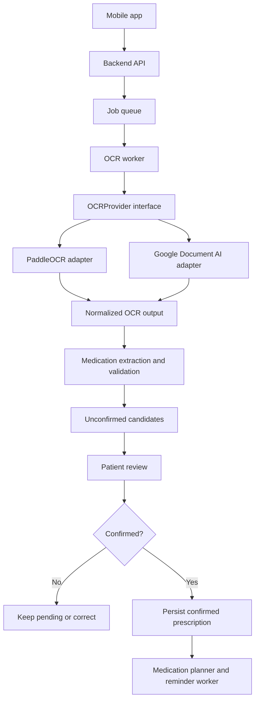

```mermaid
flowchart TD
    A[Mobile app] --> B[Backend API]
    B --> C[Job queue]
    C --> D[OCR worker]
    D --> E[OCRProvider interface]
    E --> F[PaddleOCR adapter]
    E --> G[Google Document AI adapter]
    F --> H[Normalized OCR output]
    G --> H
    H --> I[Medication extraction and validation]
    I --> J[Unconfirmed candidates]
    J --> K[Patient review]
    K --> L{Confirmed?}
    L -- No --> M[Keep pending or correct]
    L -- Yes --> N[Persist confirmed prescription]
    N --> O[Medication planner and reminder worker]
```